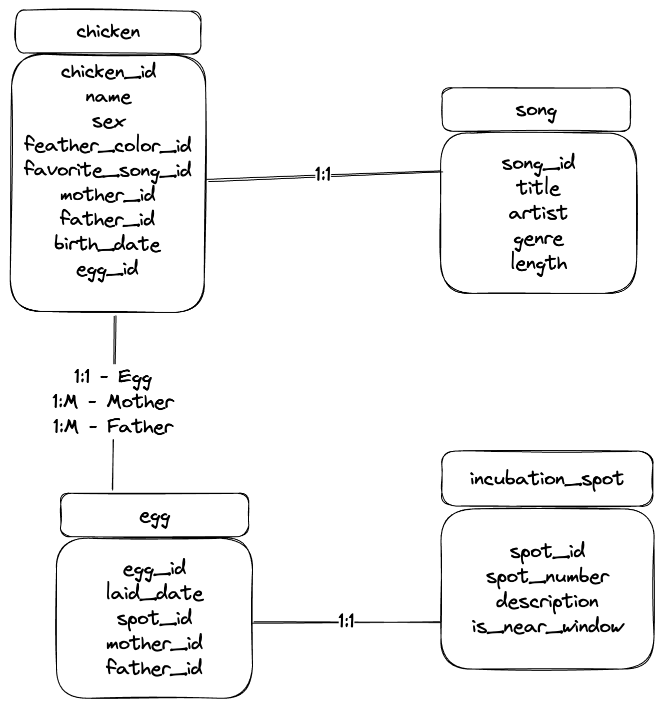

# MetabaseChallenge

## Metabase Data Analyst Problem.

Originally posted on https://gist.github.com/salsakran/387732c78eee3186da4c7091c13c18d2

### Problem Description

Pretend that you have just started at an organic, free range artisanal heritage chicken farm as their in-house analyst.

To better provide packaging to their customers, the collective ownership has decided to provide lineage information for their individual birds. 

### 1 ) Create a schema to represent chicken and egg family trees 
All chickens have
- A name
- A sex (Rooster or Hen)
- A feather color
- A favorite song 

Each Hen can will lay eggs. All eggs have
- An identification number
- A specific spot in the incubation hall where hens sit on their eggs.
- Whether that spot is near a window (as 1/3rd of the spots should be)

You should also provide a way to record the genealogy of a given chicken 
(both the egg that it came from, as well as its parents, and their eggs and the grandparents, etc)
either by adding additional columns to the chicken and egg tables or any other way you like.

Note that you will probably need more columns than just the above minimum information.

### 2 )  Generate data
Sadly, two weeks after your employment started, all records were destroyed after a ransom malware 
attack scrambled the database filesystem. Despite the farmworkers trying
to remember which chicken are have which names, it's impossible to tell them apart now.

Your boss asks you to generate fake data about all chickens 
currently on the farm (1000 chickens), some of whom are parents to others.  

- Generate 1000 records for these chickens.

What can you do to make these records seem as realistic as possible? 
(Feel free to look up data as you need to, but tell us what you looked up?
Bonus: How could a government official check whether your dataset is faked or not?
Bonus Bonus: What can you do to cover up these checks?
Bonus Bonus Bonus: What can a government official check to see whether you're covering up their checks.
Etc

### 3 )   Name tags
Once you've brought the data situation back under control, your boss tells you about a great idea his son had -- to give guided tours of the farm and introduce all the chickens to visitors. To make this possible, he wants you to create another table for each chicken with a text field they can print on a little tag to attach to each chicken's leg. 
He wants you to include:
- The chicken's name
- Favorite song
- Parents
- Grandparents
- Where each parent and grand parent was incubated
- A randomly selected first cousin of the chicken

### Bonus points
Create a dashboard in Metabase that shows some KPIs for this chicken farm, and either send us a public link or a screenshot.

# Solution

## Creating data model
    The database solution will be implemented in postgres

### DER for the final solution
