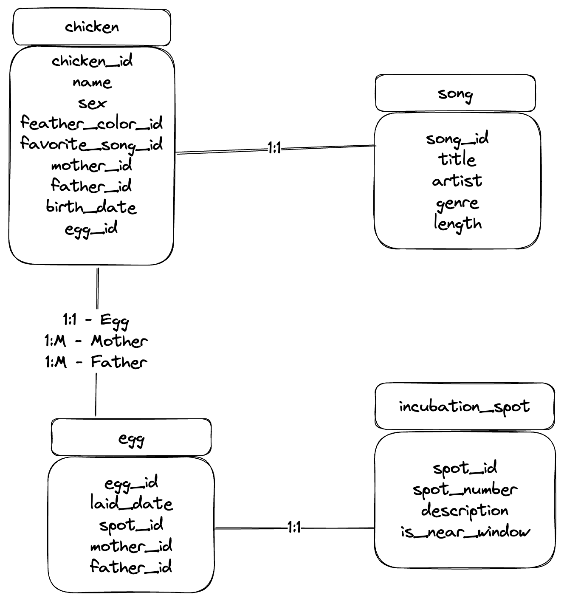
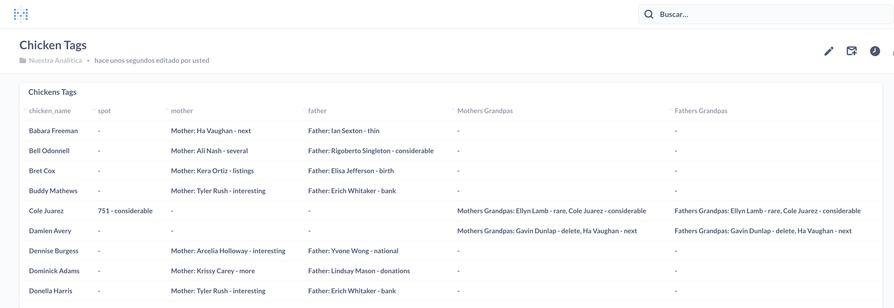

# Solution

## 1) Creating data model
    The database solution will be implemented in postgres.
    In all tables are two fields to track where a row is created and updated.

### DER for the final solution

    The egg table will be used to get the genealogy of the family tree

## 2) Data Generation
    Implemented in python using mimesis generator.
    Due to limitations of time, the data generated is not consistent and can have flaw on the genealogy of chickens.

    In the file config.json can be setup the data structure needed, as the data type.
    You can define the output as csv or sql file.
    The csv option will create a file for each table, the sql file will be an insert with all the rows.

    On future implementations the generator will allow to generate more real data, using original datasets for songs,
    and a class generator for chickens and its family.
    
### Bonus: How could a government official check whether your dataset is faked or not?
    As each table has a two fields (created_at and updated_at) to track changes, this could be a good start point for the government to check if data is fakeBonus
### Bonus: What can you do to cover up these checks?
    We can create a document that explains a procedure to follow when data is lost, in case of that event the information of those fields will be very similar due to the recovery of the database.
### Bonus Bonus Bonus: What can a government official check to see whether you're covering up their checks.
    They could apply the Benford's law to check the texts, names, and number to see if they have an counter intuitive distribution.
    They also could check some "hards" checks on the information, for example, that a chicken was born after his egg was layed of

## 3) Name tags

    Implemented with a view as an mvp (included in datamodel).
    In order to show this table in metabase, I've created a simple table to show this information
    Information is shown as "Chicken Name" - "Incubation Spot Description"s

